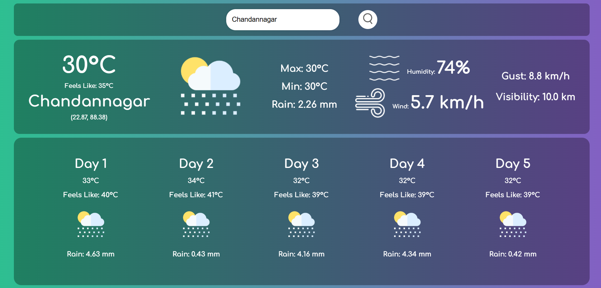

# Weather App 🌦️

A responsive weather application that displays current and 5-day forecast weather data for any city worldwide. Built with HTML, CSS, and JavaScript using the OpenWeatherMap API.

 

## Features ✨

- **Current Weather Data**:
  - Temperature (with feels-like)
  - Humidity and wind speed
  - Visibility and gust information
  - Maximum and minimum temperatures
  - Weather condition icons

- **5-Day Forecast**:
  - Daily temperature outlook
  - Expected weather conditions
  - Precipitation forecast

- **User-Friendly Interface**:
  - Clean, responsive design
  - Gradient backgrounds
  - Intuitive search functionality
  - Error handling for invalid cities

- **Technical Features**:
  - Mobile-responsive layout
  - Persistent last search (localStorage)
  - Dynamic weather icons
  - API error handling

## Technologies Used 🛠️

- **Frontend**:
  - HTML5
  - CSS3 (with Flexbox and media queries)
  - JavaScript (ES6)

- **API**:
  - [OpenWeatherMap API](https://openweathermap.org/api)

- **Fonts**:
  - Google Fonts (Comfortaa)

